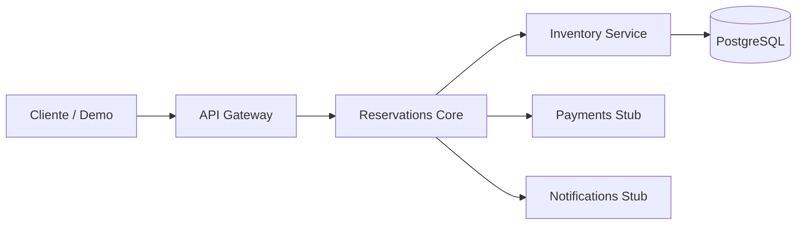

# Informe tecnico: Ticket Resilience Lab

**Tema:** Mecanismos de tolerancia a fallas en un sistema distribuido de reservas de entradas  
**Repositorio:** <https://github.com/jean-pierre-valarezo/ticket-resilience-lab.git>  
**Integrantes:** Alexander y Jean Pierre  
**Fecha:** 2026-07-14

## 1. Objetivo

Implementar y demostrar mecanismos de tolerancia a fallas sobre una arquitectura simplificada de venta de entradas desplegada en Kubernetes. La practica busca provocar fallos reales sobre un cluster de al menos dos nodos y verificar, mediante evidencia propia, que el sistema responde de forma controlada o se recupera sin colapsar.

## 2. Arquitectura implementada

La solucion se construyo como un sistema de microservicios comunicados por HTTP/REST:

- `gateway`: punto de entrada de clientes y control de rate limiting.
- `reservations`: servicio core que coordina la reserva.
- `inventory`: valida y reserva asientos usando PostgreSQL.
- `payments`: stub externo que simula latencia y fallos de pago.
- `notifications`: stub no critico que simula envio de confirmaciones.
- `postgres`: base de datos para persistencia del inventario.



## 3. Despliegue en Kubernetes

El sistema se desplego en un perfil de `minikube` llamado `ticket-lab`, con dos nodos:

- `ticket-lab`: nodo control-plane.
- `ticket-lab-m02`: nodo worker.

El namespace usado fue `ticket-lab`. Los manifiestos Kubernetes se encuentran en `k8s/base`. Para cumplir el criterio multi-nodo, el servicio critico `inventory` se configuro con 2 replicas y `topologySpreadConstraints` sobre `kubernetes.io/hostname`, de modo que Kubernetes intente distribuir los pods entre ambos nodos.

**Evidencia disponible:**

- `docs/evidence/01-k8s-dos-nodos-ready.png`
- `docs/evidence/02-k8s-pods-inventory-replicado-dos-nodos.png`

## 4. Mapeo de los seis fallos

| Fallo | Tipo de problema | Mecanismo de inyeccion | Estado en la practica |
| --- | --- | --- | --- |
| Inventario Fantasma | Disponibilidad | Escalar `deployment/inventory` a 0 replicas | Implementado |
| Pasarela Lenta | Latencia | Configurar `PAYMENT_DELAY_MS=20000` | Implementado |
| Diluvio de Peticiones | Sobrecarga | Enviar multiples solicitudes seguidas al gateway | Implementado |
| Base de Datos Intermitente | Conectividad | Cortes/flapping hacia PostgreSQL o reinicio controlado | Analisis teorico |
| Correo Perdido | Fallo no critico | Escalar `deployment/notifications` a 0 replicas | Implementado |
| Condicion de Carrera | Consistencia | Compras concurrentes sobre el mismo asiento | Analisis teorico |

## 5. Mecanismos de resiliencia implementados

### 5.1 Inventario Fantasma

**Falla inyectada:** el servicio `inventory` se escala a 0 replicas.

**Defensa:** el servicio `reservations` aplica retry con backoff hacia inventario y, si no logra validar disponibilidad, responde con un error controlado. Esto evita confirmar una reserva sin haber descontado inventario.

**Resultado observado:** la reserva falla con `HTTP 503`, sin generar una confirmacion falsa.

**Evidencia:** `docs/evidence/09-chaos-inventory-down-http-503.png`

### 5.2 Pasarela Lenta

**Falla inyectada:** el servicio `payments` recibe `PAYMENT_DELAY_MS=20000`, simulando una pasarela que tarda 20 segundos en responder.

**Defensa:** `reservations` usa timeout al invocar pagos y mantiene un circuit breaker en memoria. Despues de tres fallos, el circuito pasa a estado `open` y rechaza nuevas llamadas antes de saturar el sistema.

**Resultado observado:** cuatro intentos devuelven `HTTP 503`; el endpoint `/resilience` muestra `payment_circuit.state = open` y `failure_count = 3`.

**Evidencia:**

- `docs/evidence/11-chaos-payments-slow-circuit-breaker-open-1.png`
- `docs/evidence/12-chaos-payments-slow-circuit-breaker-open-2.png`

### 5.3 Correo Perdido

**Falla inyectada:** el servicio `notifications` se escala a 0 replicas.

**Defensa:** la notificacion se trata como dependencia no critica. Si falla, la reserva no se cancela; se marca la notificacion como `pending`.

**Resultado esperado:** la respuesta debe ser `HTTP 200`, con `status = confirmed` y `notification.status = pending`.

**Evidencia:** `docs/evidence/15-chaos-notifications-down-fallback-pending.png`

### 5.4 Diluvio de Peticiones

**Falla inyectada:** se ejecutan 25 solicitudes seguidas contra `POST /reserve`.

**Defensa:** el `gateway` mantiene un registro temporal por cliente y aplica rate limiting. Cuando se supera la ventana configurada, responde `HTTP 429`.

**Resultado esperado:** deben observarse respuestas `HTTP 429`. Con la correccion aplicada, los conflictos de asiento ocupado se reportan como `HTTP 409`, y la sobrecarga se reporta como `HTTP 429`.

**Evidencia:** `docs/evidence/17-chaos-traffic-spike-rate-limit-429.png`

## 6. Evidencia base de funcionamiento

Antes de inyectar fallos se valido el flujo normal del sistema:

- `GET /health` en `gateway`: `HTTP 200`.
- `GET /health` en `inventory`: `HTTP 200`.
- Consulta de inventario inicial.
- Reserva exitosa con `status = confirmed`.
- Inventario posterior con asiento en estado `reserved`.

**Evidencias:**

- `docs/evidence/04-baseline-health-inventario-inicial-1.png`
- `docs/evidence/05-baseline-inventario-inicial-2.png`
- `docs/evidence/06-baseline-reserva-exitosa.png`
- `docs/evidence/07-baseline-inventario-despues-1.png`
- `docs/evidence/08-baseline-inventario-despues-2.png`

## 7. Guion de demo

1. Mostrar cluster multi-nodo:

```powershell
kubectl get nodes -o wide
```

2. Mostrar componentes desplegados:

```powershell
kubectl -n ticket-lab get pods -o wide
```

3. Abrir port-forward:

```powershell
.\scripts\13-stop-port-forward.ps1
.\scripts\03-port-forward.ps1
```

4. Validar flujo base:

```powershell
.\scripts\04-baseline-evidence.ps1
```

5. Inventario caido:

```powershell
.\scripts\05-chaos-inventory-down.ps1
.\scripts\06-recover-inventory.ps1
```

6. Pasarela lenta:

```powershell
.\scripts\07-chaos-payments-slow.ps1
.\scripts\08-recover-payments.ps1
```

7. Notificaciones caidas:

```powershell
.\scripts\09-chaos-notifications-down.ps1
.\scripts\10-recover-notifications.ps1
```

8. Diluvio de peticiones:

```powershell
Start-Sleep -Seconds 12
.\scripts\11-chaos-traffic-spike.ps1
```

## 8. Analisis teorico de fallos no implementados

### 8.1 Base de Datos Intermitente

Una base de datos intermitente produce fallos durante operaciones de escritura. En un sistema distribuido, esto se relaciona con particiones de red y disponibilidad parcial: aunque los servicios sigan ejecutandose, no pueden garantizar persistencia si pierden conectividad con la base de datos. Desde la perspectiva CAP, una particion obliga a priorizar consistencia o disponibilidad. En reservas de entradas, confirmar una compra sin escritura durable puede crear ventas fantasma o perdida de inventario.

**Solucion de produccion propuesta:**

- Base de datos administrada con alta disponibilidad y failover.
- Pool de conexiones con limites para evitar saturacion.
- Retries con backoff y jitter solo en operaciones idempotentes.
- Idempotency keys por solicitud de compra.
- Readiness probes que retiren pods no saludables.
- Outbox transaccional para eventos posteriores a la escritura.

**Pseudocodigo:**

```text
function reserveSeat(request):
    key = request.idempotencyKey

    existing = findReservationByKey(key)
    if existing:
        return existing

    for attempt in 1..MAX_RETRIES:
        try:
            begin transaction
            seat = select seat for update
            if seat.status != available:
                rollback
                return conflict

            mark seat as reserved
            create reservation with idempotency key
            write outbox event "reservation_created"
            commit
            return confirmed
        catch transient_database_error:
            rollback
            sleep backoff_with_jitter(attempt)

    return controlled_unavailable_error
```

### 8.2 Condicion de Carrera

La condicion de carrera ocurre cuando dos usuarios intentan reservar el mismo asiento simultaneamente. Si el sistema verifica disponibilidad y descuenta inventario en pasos separados sin aislamiento transaccional, ambos procesos pueden observar el asiento como disponible y confirmar ventas duplicadas.

**Solucion de produccion propuesta:**

- Transacciones ACID.
- Bloqueo pesimista con `SELECT ... FOR UPDATE`.
- Restriccion unica por asiento activo.
- Reserva temporal con expiracion para mantener el asiento durante el pago.
- Confirmacion final solo si el hold sigue vigente.

**Pseudocodigo:**

```text
function createHold(eventId, seatId, userId):
    begin transaction
    seat = select * from seats
           where event_id = eventId and seat_id = seatId
           for update

    if seat.status != available:
        rollback
        return conflict

    insert hold(eventId, seatId, userId, expiresAt)
    update seat set status = held
    commit
    return hold_created

function confirmHold(holdId, paymentId):
    begin transaction
    hold = select * from holds where id = holdId for update
    if hold.expired:
        rollback
        return expired

    update seat set status = reserved
    create reservation(paymentId)
    commit
    return confirmed
```

## 9. Conclusiones

La practica demuestra que los patrones de resiliencia no son decorativos: deben ubicarse en el punto correcto de la arquitectura. El retry con backoff protege llamadas transitorias, pero no debe ocultar fallos definitivos. El circuit breaker evita que una dependencia lenta consuma recursos indefinidamente. El fallback permite continuar cuando falla una dependencia no critica. El rate limiting protege el borde del sistema ante sobrecarga.

En conjunto, el laboratorio permite evidenciar tolerancia a fallas de forma reproducible sobre Kubernetes y deja documentados los escenarios que se implementaron, los comandos de inyeccion y el comportamiento esperado del sistema.

## 10. Evidencias finales

Las capturas finales se encuentran en `docs/evidence/` y cubren:

1. Cluster Kubernetes con dos nodos en estado `Ready`.
2. Pods desplegados con `inventory` replicado entre los dos nodos.
3. Flujo base con health checks, reserva confirmada e inventario actualizado.
4. Inventario caido con respuesta controlada `HTTP 503`.
5. Pasarela lenta con circuit breaker abierto.
6. Notificaciones caidas con reserva confirmada y notificacion pendiente.
7. Diluvio de peticiones con respuestas `HTTP 429`.
